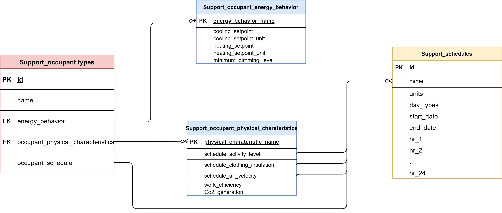

# Database Structure and Covered Data
## Structure
The figure below shows an overview of the structure of the database and of the data management approach.

## Covered Data
As shown in the figure above, the database contains two types of data: space type data and non-space type related data. The space type related data is made of three distinct but interconnected levels.

- The first level, level 1, corresponds to a single data table that contains a list of space type names supported by OpenStudio-Standards and a mapping to different sub-space type names (such as lighting, ventilation, and equipment, etc.) that can be used to determine general modeling assumption for a space type for a specific building energy code version.
- The second level, level 2, is a collection of data tables that contains lists of sub-space type names and references to different code requirement values.
- The third and final level, level 3, is a collection of data tables that contains raw information from building energy codes, such as lighting power allowances and required ventilation rates.
The list of space type provided in the level 1 table is a concise yet exhaustive list of space type that can be used to model most commercial building spaces. Assumptions for these space types are contained in the level 2 and level 3 tables, however these tables contain additional information about more specific space type requirements (or less specific, e.g., through the building area method lighting power allowances).

This approach lends itself to customization, for example, the mapping of a particular space type name to sub-space type can be overwritten by changing the reference to the sub-space types (level 2) in the level 1 table. Another possible use of the database is to only access the level 3 data tables to get a direct access to the raw code information in a tabulated format which, again, contains more data than what is used to derive the modeling assumptions for the space types listed in the level 1 table.

The non-space type related data, contains all other data needed by OpenStudio-Standards, this includes constructions/materials tables, performance curves tables, minimum code required HVAC efficiency, system requirements, etc.

### Space Type Data
#### Space Type Names
The space type names list has been created using engineering judgment and the space type name list from the ASHRAE Standard 90.1 lighting building area and space-by-space tables. Space type names were either concatenated or simplified to be self-descriptive.
#### Lighting
Lighting assumptions for each space type comes from actual building energy code requirements. As the space type names referenced in each version of ASHRAE Standard 90.1 changes from one version to another, a mapping effort was conducted to reconcile the requirements for each space type for all versions of the code.
#### People density and Ventilation
The people density and ventilation data originate from values specified in ASHRAE Standard 62.1. Similarly to the lighting data, a mapping effort was conducted to reconcile the requirements for each space type for all versions of the code. While OpenStudio-Standards currently offers data for the 2004 version of 90.1 up to the 2019 version of 90.1, ventilation/people density values for some space type could not be found for all versions of 62.1. In this instance, if available, older values were used, all the way to 62.1-1999 when needed.
#### Equipment
The equipment assumptions are based on a plug-load values derived from a project led at the Pacific Northwest National Laboratory (PNNL) named *Development of Building-Space-Specific Loads for Performance Rating Methods*. Plug-load for each space type were determined using a bottom-up approach, see the figure below. Minimum, maximum, average, and median equipment power density values are provided (average values are currently used when exporting the data to the JSON files used by OpenStudio-Standards).

#### Schedules
The schedules used in the database were determined based on the PNNL led *Development of Building-Space-Specific Loads for Performance Rating Methods* project. The schedules were derived from the [SBEM-NCN database](https://www.ncm-pcdb.org.uk/sap/page.jsp?id=7), modifications were applied to make them perceived as more realistic such as reducing the occupancy fraction during the day (as space is very rarely fully occupied), or leave a very small fraction of the lights on at night. 

### Occupant Types Dataset
Different groups of occupants may exhibit varying behaviors influenced by factors such as the type of space, cultural background, and social context. The occupant types database is designed to caputure diverse behavioral patterns and create a representative dataset that enables users to improve the building energy modeling and advance research on dynamic occupant behavior. 

#### Occupant Types Data Structure
This database is insipried by a previous work led by Lawrence Berkeley National Laboratory (LBNL) [(Sun and Hong 2017)](https://www.sciencedirect.com/science/article/abs/pii/S0378778817302013), which established a framework categorizing occupant types into three primary categories: 
- energy behavior (including actions related to thermostat and lighting),
- physical characteristics of occupants (including clothing insulation, work efficiency, CO2 generation, and air velocity),
- 24-hour occupant schedule. 

The structure of the occupant type database is illustrated in the following figure:

#### Energy behavior
The energy behavior is further divided into three categories:
- wasteful occupants prefer colder settings during cooling seasons and higher settings during heating seasons and never dim the lights in their space 
- austerity occupants have the opposite preferences on thermostat settings and always dim the lights when daylight is sufficient
- and normal occupants behave in a typical manner. 

#### Physical Charateristics
For physical characteristics, the options that can be modified by the user include clothing insulation, work efficiency, CO2 generation rate, and air velocity. 

#### Occupancy Schedule
Occupancy density over 24 hours on weekdays and weekends is based on the analysis of the multiple years of the [American Time Use Survey](https://www.bls.gov/tus/). The clustering algorithm determined four optimal clusters: early birds, late owls, regular 8-hour workers, and night shift workers,the clustering result can be seen in following figure. Default values for each cluster are based on their respective ratios.

The specific details of each subcategory of design occupant types are summarized in the following table. It is worth noting that this database currently focuses on office buildings.

<table>
<tr><td><b>Space Type</b></td><td><b>Occupant type subcategory</b></td><td><b>Reference</b></td><td><b>Notes</b></td></tr>
<tr><td rowspan="6">Office</td><td>Occupant schedule</td><td><a href="https://www.bls.gov/tus/">American Time Use Survey</a></td><td>Early birds, late owls, regular 8-hour workers, and night shift workers, and weekend schedule; Clustering algorithm used on office worker.</td></tr>
<tr><td>Thermostat behavior</td><td><a href="https://www.sciencedirect.com/science/article/abs/pii/S1364032119308019">Learning occupants’ indoor comfort temperature through a Bayesian inference approach for office buildings in United States</td><td>A data-driven approach to learn thermal comfort preference in office buildings through ASHRAE Thermal Comfort Database.</td></tr>
<tr><td>Lighting behavior</td><td><a href="https://www.sciencedirect.com/science/article/pii/S0360132317300501">Lighting preference profiles of users in an open office environment</td><td>Lighting preference profiles based on objective measurements and subjective data obtained in two field studies.</td><td></tr>
<tr><td>Clothing insulation</td><td><a href="https://search.worldcat.org/title/2013-ASHRAE-handbook-:-fundamentals/oclc/882088522">ASHRAE Handbook Fundamentals</td><td>Table 7 in Chapter 9 provides a reference for estimating the clothing insulation levels of occupants. </td></tr>
<tr><td>CO2 generation rate</td><td><a href="https://www.ashrae.org/technical-resources/standards-and-guidelines/read-only-versions-of-ashrae-standards">ANSI/ASHRAE Standard 62.1-2017 </td><td>A default metabolic rate of 1 met is assumed.</td><td></tr>
</table>

**Notice**: This initial design of the occupant types database focuses specifically on office space types and has not yet been integrated into simulation software. 